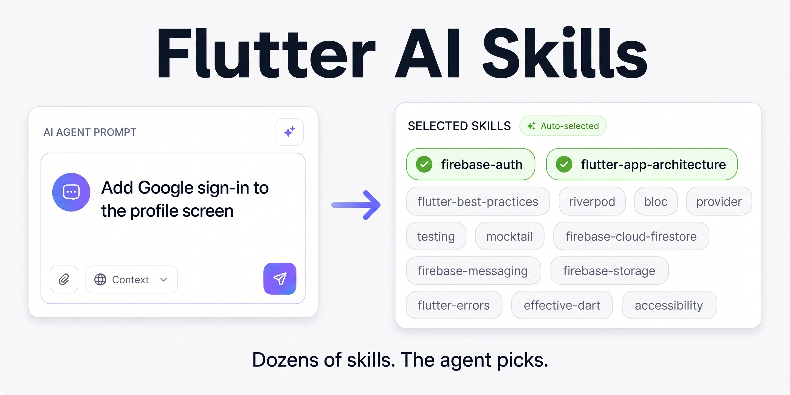

# Flutter AI Skills for Claude Code, Codex, Cursor, Antigravity, and Other AI Coding Agents



**36 Flutter and Dart skills your coding agent loads by itself, sourced only from official documentation.**

A skill is a folder with a `SKILL.md` file. Your agent reads the description, decides a task matches, and pulls in the guidance — you don't paste anything into a rules file or remember to `@`-mention a doc. Install once, and Firebase Auth guidance shows up when you touch auth, Riverpod guidance when you touch providers.

A comprehensive, (almost) non-opinionated collection: everything here is derived from official Flutter, Dart, Firebase, and package documentation. No personal preferences, no invented conventions.

## ⚡ Quick start

```sh
npx skills add evanca/flutter-ai-rules
```

That's it. The [Skills CLI](https://www.npmjs.com/package/skills) discovers the packages under [`skills/`](./skills) and installs them for supported agents.

Browse before installing, or take just one:

```sh
npx skills add evanca/flutter-ai-rules --list
npx skills add evanca/flutter-ai-rules --skill flutter-best-practices
```

Prefer to do it by hand? Copy or symlink any skill folder into your agent's skills directory — `.claude/skills/`, `.cursor/skills/`, `.agent/skills/`, `.windsurf/skills/`. Or vendor the whole set into your project:

```sh
git clone --depth 1 https://github.com/evanca/flutter-ai-rules.git temp_repo && mkdir -p .skills && cp -r temp_repo/skills/* .skills && rm -rf temp_repo
```

With a `.skills/` folder you can also reference a skill explicitly when you want it: *"Read `@.skills/bloc/SKILL.md` and create test coverage for the new methods."*

## 🧠 What's in the box

### Flutter and Dart foundations

| Skill | Loads when you're… |
|---|---|
| [`flutter-best-practices`](./skills/flutter-best-practices) | Writing, reviewing, or planning Flutter code |
| [`effective-dart`](./skills/effective-dart) | Writing Dart, naming things, adding doc comments |
| [`dart-3-updates`](./skills/dart-3-updates) | Using records, patterns, sealed classes, switch expressions |
| [`flutter-app-architecture`](./skills/flutter-app-architecture) | Scaffolding a project or refactoring into layers |
| [`architecture-feature-first`](./skills/architecture-feature-first) | Designing folder structure for a new feature |
| [`flutter-errors`](./skills/flutter-errors) | Hitting RenderFlex overflows, unbounded constraints, layout errors |
| [`flutter-use-column-row-first`](./skills/flutter-use-column-row-first) | Building responsive layouts with Row, Column, Expanded, Flexible |
| [`flutter-pre-caching`](./skills/flutter-pre-caching) | Preloading fonts, images, animations, or config |

### State management

| Skill | Loads when you're… |
|---|---|
| [`bloc`](./skills/bloc) | Creating a Cubit or Bloc, modeling state, wiring providers |
| [`riverpod`](./skills/riverpod) | Setting up providers, combining requests, managing disposal |
| [`provider`](./skills/provider) | Consuming state, optimizing rebuilds, using ProxyProvider |
| [`flutter-change-notifier`](./skills/flutter-change-notifier) | Setting up ChangeNotifier models and consuming them |

### Testing and review

| Skill | Loads when you're… |
|---|---|
| [`testing`](./skills/testing) | Writing unit, widget, or golden tests; fixing flaky tests |
| [`mockito`](./skills/mockito) | Generating mocks, stubbing, verifying interactions |
| [`mocktail`](./skills/mocktail) | Mocking without codegen, registering fallback values |
| [`patrol-e2e-testing`](./skills/patrol-e2e-testing) | Writing E2E tests that touch native permissions or dialogs |
| [`code-review`](./skills/code-review) | Reviewing a PR, branch, or diff |

### Firebase

| Skill | Loads when you're… |
|---|---|
| [`flutterfire-configure`](./skills/flutterfire-configure) | Adding Firebase to a project, running `flutterfire configure` |
| [`firebase-auth`](./skills/firebase-auth) | Setting up auth, managing auth state, social sign-in |
| [`firebase-cloud-firestore`](./skills/firebase-cloud-firestore) | Designing schemas, CRUD, listeners, pagination |
| [`firebase-database`](./skills/firebase-database) | Syncing real-time data, structuring JSON trees |
| [`firebase-storage`](./skills/firebase-storage) | Uploading and downloading files, managing metadata |
| [`firebase-analytics`](./skills/firebase-analytics) | Logging events, setting user properties |
| [`firebase-crashlytics`](./skills/firebase-crashlytics) | Capturing fatal and non-fatal errors |
| [`firebase-messaging`](./skills/firebase-messaging) | Setting up FCM, handling background messages |
| [`firebase-in-app-messaging`](./skills/firebase-in-app-messaging) | Running in-app campaigns |
| [`firebase-remote-config`](./skills/firebase-remote-config) | Implementing feature flags or A/B tests |
| [`firebase-app-check`](./skills/firebase-app-check) | Configuring attestation and debug tokens |
| [`firebase-cloud-functions`](./skills/firebase-cloud-functions) | Calling callable functions, handling errors |
| [`firebase-ai`](./skills/firebase-ai) | Generating text or chat with Gemini via `firebase_ai` |
| [`firebase-data-connect`](./skills/firebase-data-connect) | Writing GraphQL queries against Data Connect |

### Shipping and product

| Skill | Loads when you're… |
|---|---|
| [`accessibility`](./skills/accessibility) | Working on a11y, WCAG, screen readers, focus order |
| [`inclusive-design`](./skills/inclusive-design) | Handling i18n, global name/address forms, low-end devices |
| [`store-listing-assets`](./skills/store-listing-assets) | Writing store copy to character limits |
| [`revenuecat-testing`](./skills/revenuecat-testing) | Testing purchases, subscriptions, sandbox flows |
| [`developing-genkit-dart`](./skills/developing-genkit-dart) | Building AI agents in Dart with Genkit |

## 🗂️ Rules and combined sets (legacy)

Before skills existed, this repo shipped rule files you pasted into a config, plus pre-merged bundles squeezed under Windsurf's character cap. Both still work and both are still updated, but **skills are the recommended path** — they load contextually instead of consuming your context window on every request.

Reach for these only if your tool has no skills support, or you want one static file you fully control:

- **[`rules/`](./rules)** — six broad foundation files: `effective_dart.md`, `flutter_app_architecture.md`, `flutter_errors.md`, `dart_3_updates.md`, `testing.md`, `code_review.md`. Drop them in your project and reference them by name: *"Read @rules/effective_dart.md and follow its conventions."* Package-specific guidance (Bloc, Riverpod, Firebase, Mockito…) is **skills-only** now.
- **[`combined/`](./combined)** — seven topic bundles, each in a full and an `__under_6K` variant. Paste one into your global or local rules config and you're done. The trimmed variants stay under 6,000 characters to fit Windsurf's `global_rules.md` hard limit.

## 📏 Recommended file sizes by tool

Size guidance from each tool's **own official documentation**, for rule/instruction files and for `SKILL.md` files (accessed 2026-07-11).

| Tool | Rule file — recommended size | `SKILL.md` — recommended size |
|------|------------------------------|-------------------------------|
| **Claude Code** | `CLAUDE.md`: under **200 lines** *(soft)* | Under **500 lines** *(soft)*; `description` **1,536 chars** *(hard)* |
| **Cursor** | `.mdc` rule: under **500 lines** *(soft)* | **No numeric limit** — "keep focused, move detail to separate files" |
| **OpenAI Codex** | `AGENTS.md`: **no limit stated** | Skill bundle: zip **≤ 50 MB**, uncompressed file **≤ 25 MB**, **≤ 500** files/version (no per-`SKILL.md` text limit) |
| **Google Antigravity** | rule file: **12,000 chars** each *(hard)* | **No numeric limit stated** |
| **Windsurf** | `global_rules.md`: **6,000 chars**; `.windsurf/rules/*.md`: **12,000 chars**/file *(hard)* | **No numeric limit** — "keeps your context window lean" |
| **GitHub Copilot** | `copilot-instructions.md`: **≤ 2 pages** *(soft, approx.)* | **Not supported** — no repo-level `SKILL.md` |

**Notes:**
- **Hard** = enforced/truncated at the limit; **soft** = a documented quality recommendation.
- **Only Claude Code publishes a numeric `SKILL.md` *length* recommendation** (under 500 lines). Cursor, Windsurf, and Antigravity just say "keep it focused/lean" with no figure; **OpenAI** documents skill-*bundle* limits (50 MB zip / 25 MB per file / 500 files) rather than a text length; and **GitHub Copilot has no repo-level `SKILL.md`** — it uses `copilot-instructions.md` plus path-specific `*.instructions.md` (no size limit stated for the latter).
- **Claude Code** loads `CLAUDE.md` in full regardless of length, but notes files over 200 lines "consume more context and reduce adherence"; its auto-memory `MEMORY.md` loads only the "first 200 lines or 25KB, whichever comes first."
- **Windsurf** is still named Windsurf; its docs are served through Cognition (`docs.windsurf.com` → `docs.devin.ai`) and reference `.windsurf/rules` and `.windsurf/skills`.
- This repo keeps the [`combined/`](./combined) sets under **6,000 characters** to satisfy the strictest hard limit above (Windsurf `global_rules.md`).

**Official sources:** Claude Code — [memory](https://code.claude.com/docs/en/memory) · [skills](https://code.claude.com/docs/en/skills) | Cursor — [rules](https://cursor.com/docs/context/rules) · [skills](https://cursor.com/docs/skills) | OpenAI Codex — [AGENTS.md](https://agents.md/) · [skills](https://developers.openai.com/api/docs/guides/tools-skills#limits-and-validation) | Google Antigravity — [rules](https://antigravity.google/docs/rules-workflows) · [skills](https://antigravity.google/docs/skills) | Windsurf — [rules & skills](https://docs.windsurf.com/windsurf/cascade/memories) | GitHub Copilot — [instructions](https://docs.github.com/en/copilot/how-tos/configure-custom-instructions/add-repository-instructions)

## 📌 No opinions, just documentation

Every skill is sourced from official documentation — no personal preferences or subjective interpretations. That's intentional. You're free to alter them to taste, but this repo stays objective by sticking to the source.

One consequence worth knowing: skills can contradict each other, because their sources do. If one package recommends a folder layout and another recommends a different one, you'll see both.

Content is re-fetched from upstream docs on a schedule, so skills track the official guidance as it changes rather than freezing at whatever was true when they were written.

## 🛠️ Contributing

Contributions are welcome:

1. Fork this repository.
2. Add or modify a skill in [`skills/`](./skills), or a rule in [`rules/`](./rules).
3. Open a pull request explaining the change.

**Include an official documentation link** for anything you add or change. That's the one hard requirement — it's what keeps the repo objective and reviewable.

## 📚 Sources

Official documentation these skills are built from:

**Flutter** — [App Architecture](https://docs.flutter.dev/app-architecture) · [Common Errors](https://docs.flutter.dev/testing/common-errors) · [Simple State Management](https://docs.flutter.dev/data-and-backend/state-mgmt/simple)

**Dart** — [Effective Dart](https://dart.dev/effective-dart) · [Language tour](https://dart.dev/language) · [Records](https://dart.dev/language/records) · [Patterns](https://dart.dev/language/patterns) · [Pattern types](https://dart.dev/language/pattern-types) · [Branches](https://dart.dev/language/branches)

**State management** — [Bloc](https://bloclibrary.dev/) · [Riverpod](https://riverpod.dev/) · [Provider](https://pub.dev/packages/provider)

**Testing** — [Mockito](https://pub.dev/packages/mockito) · [Mocktail](https://pub.dev/packages/mocktail) · [Patrol](https://patrol.leancode.co/)

**Firebase** — [Firebase for Flutter](https://firebase.google.com/docs/flutter/setup) · [FlutterFire](https://firebase.flutter.dev/) · [Multiple flavors with the FlutterFire CLI](https://codewithandrea.com/articles/flutter-firebase-multiple-flavors-flutterfire-cli/)

## 📄 License

[MIT](./LICENSE).
